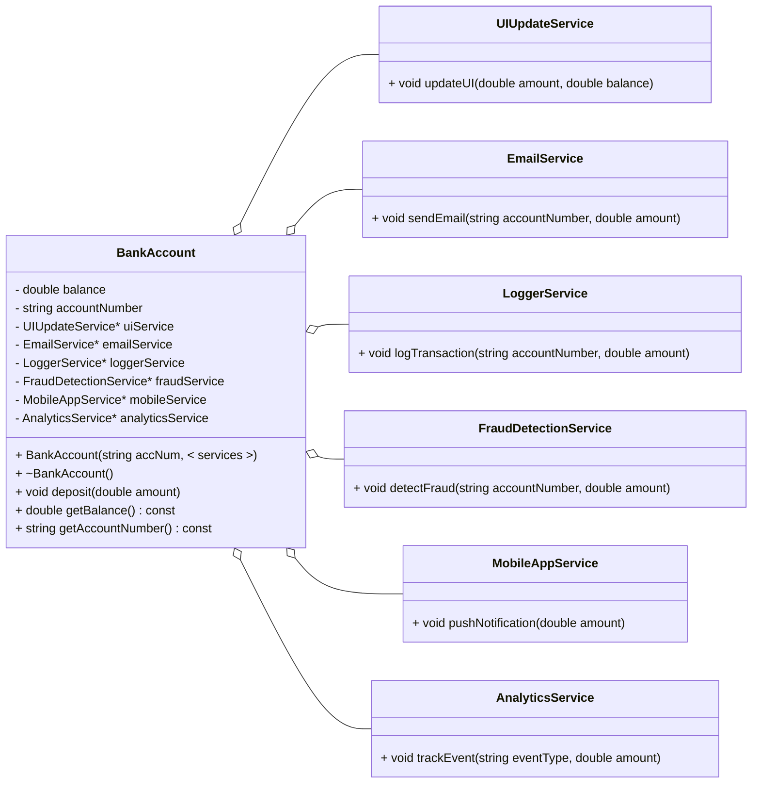

# Naive BankAccount UML Class Diagram

```mermaid
classDiagram
    direction LR
    class BankAccount {
        - double balance
        - string accountNumber
        - UIUpdateService* uiService
        - EmailService* emailService
        - LoggerService* loggerService
        - FraudDetectionService* fraudService
        - MobileAppService* mobileService
        - AnalyticsService* analyticsService
        + BankAccount(string accNum, < services >)
        + ~BankAccount()
        + void deposit(double amount)
        + double getBalance() const
        + string getAccountNumber() const
    }

    class UIUpdateService {
        + void updateUI(double amount, double balance)
    }

    class EmailService {
        + void sendEmail(string accountNumber, double amount)
    }

    class LoggerService {
        + void logTransaction(string accountNumber, double amount)
    }

    class FraudDetectionService {
        + void detectFraud(string accountNumber, double amount)
    }

    class MobileAppService {
        + void pushNotification(double amount)
    }

    class AnalyticsService {
        + void trackEvent(string eventType, double amount)
    }

    BankAccount o-- UIUpdateService
    BankAccount o-- EmailService
    BankAccount o-- LoggerService
    BankAccount o-- FraudDetectionService
    BankAccount o-- MobileAppService
    BankAccount o-- AnalyticsService
```
